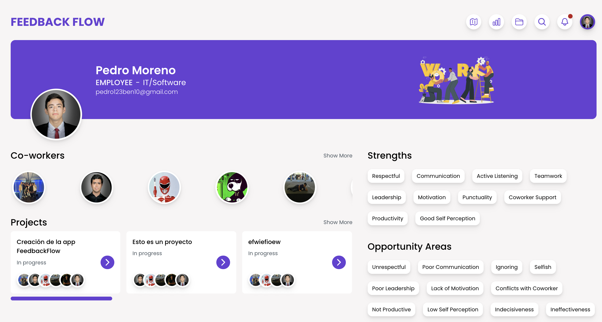
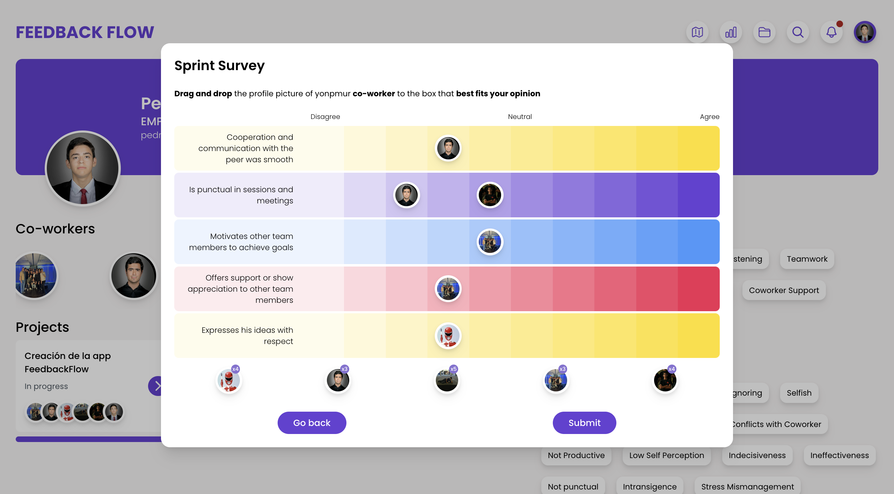
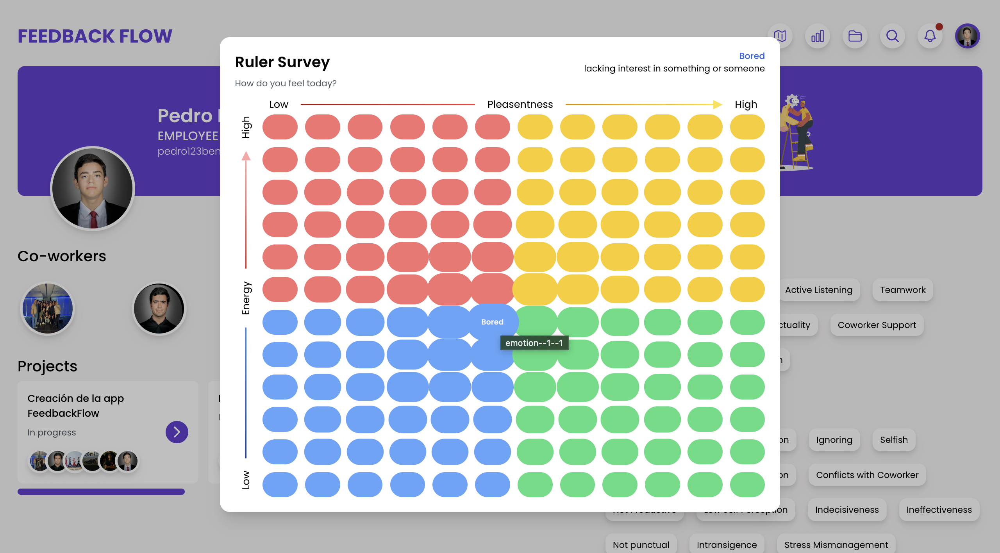
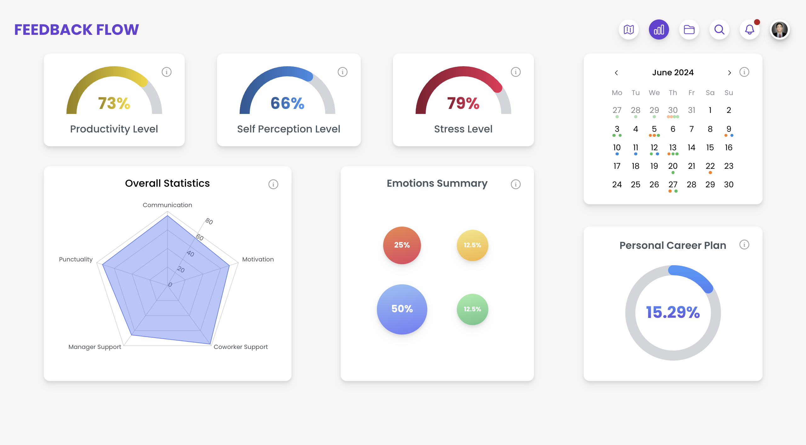
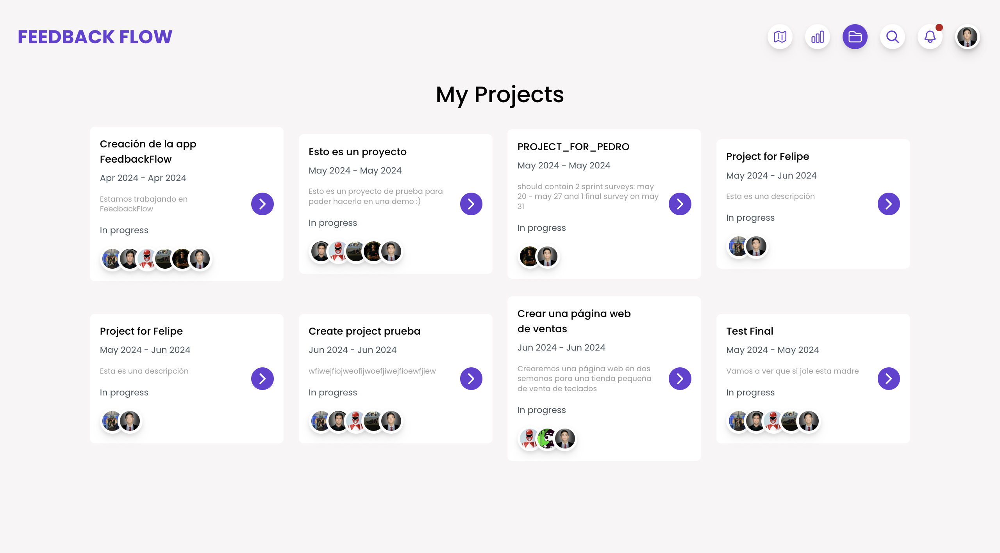
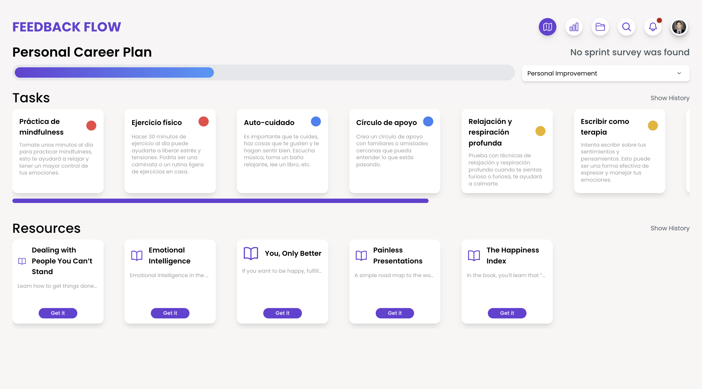
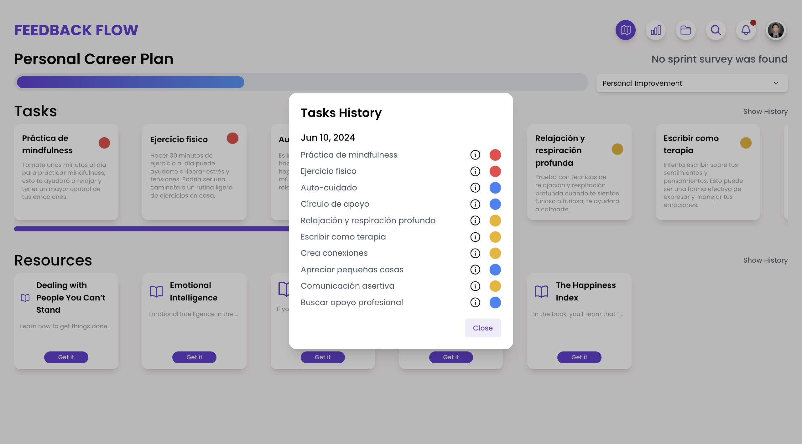
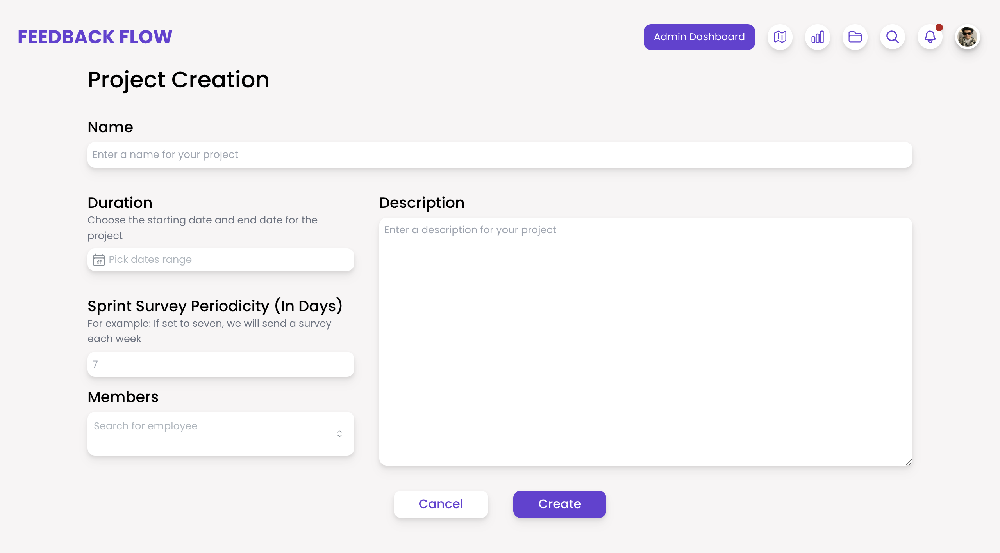
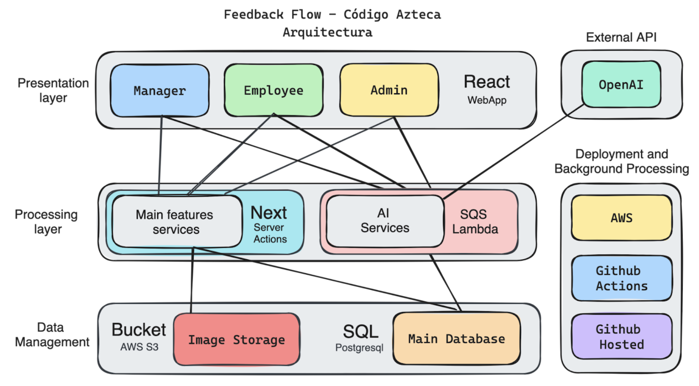
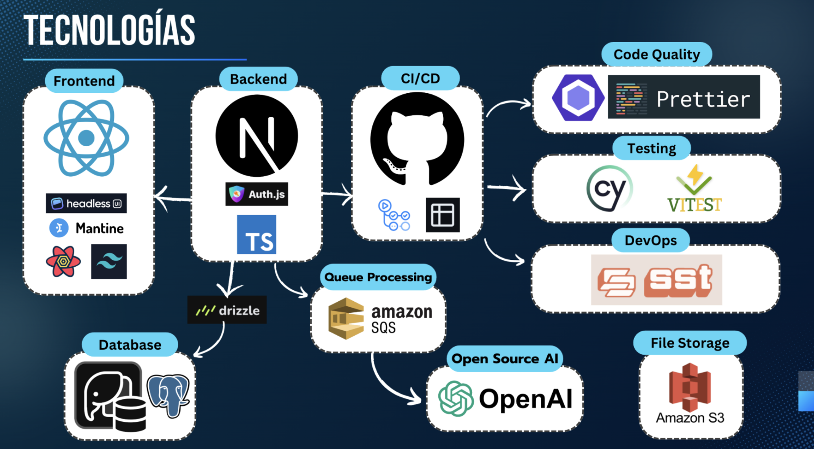

# FeedbackFlow

Una plataforma de retroalimentación y evaluación para empleados dentro de una empresa que usa inteligencia artificial para reducir sesgos, sugerir planes de mejora y ayudar al empleado a resolver dudas diarias.

[📌 Diseño de Figma](https://www.figma.com/file/klnYbVO4bRceWdcZrKkmZq/MockUp?type=design&node-id=0%3A1&mode=design&t=ZbcneFEULlyu53gy-1)










# Diagrama de Arquitectura

https://excalidraw.com/#room=4e86bc2d7aa398220159,Rx-NMC5JHMVoTkhTiVgTYw



# Diagrama de Tecnologías



# Breve descripción de cada tecnología

- **React.js:** Biblioteca de JavaScript para construir interfaces de usuario.
- **HeadlessUI:** Componentes UI accesibles y no opinados para React y Vue.
- **Mantine:** Biblioteca de componentes y hooks para React, con enfoque en la accesibilidad y usabilidad.
- **ReactQuery:** Librería para gestionar el estado de las solicitudes de datos en aplicaciones React.
- **Tailwind:** Framework de CSS basado en utilidades para diseñar rápidamente interfaces.
- **Next.js:** Framework de React para desarrollo de aplicaciones web estáticas y dinámicas con renderizado del lado del servidor.
- **Auth.js:** Solución para autenticación en aplicaciones web, previamente conocida como NextAuth.js.
- **TypeScript:** Lenguaje de programación que extiende JavaScript con tipado estático opcional.
- **Postgres:** Sistema de gestión de bases de datos relacional de código abierto.
- **Vercel Postgres:** Servicio de bases de datos Postgres gestionado y escalable ofrecido por Vercel.
- **Amazon SQS:** Servicio de cola de mensajes completamente gestionado de Amazon Web Services.
- **OpenAI:** Organización y tecnología que desarrolla inteligencia artificial avanzada, como GPT-4.
- **GitHub Actions:** Plataforma de integración y entrega continua para automatizar flujos de trabajo de desarrollo.
- **GitHub Projects:** Herramienta de gestión de proyectos y seguimiento de tareas integrada en GitHub.
- **ESLint:** Herramienta de análisis estático para encontrar y corregir problemas en el código JavaScript.
- **Prettier:** Formateador de código que asegura un estilo consistente en múltiples lenguajes.
- **Cypress:** Framework para pruebas end-to-end automatizadas en aplicaciones web.
- **Vitest:** Framework de pruebas unitarias para proyectos Vite.
- **Ion SST:** Framework para desplegar aplicaciones serverless en AWS con infraestructura como código.
- **Amazon S3:** Servicio de almacenamiento de objetos escalable y duradero de Amazon Web Services.

# 📚 Uso

Asegurate de tener el archivo `.env.local` en tu proyecto

```env
AUTH_SECRET=<YOUR KEY>
POSTGRES_URL=<YOUR KEY>
OPENAI_KEY=<YOUR KEY>
```

Para correr la app sin hacer un despliegue local en SST (más rápido)

```bash
npm run dev
```

Para correr la app con un despliegue local en SST (aquí se pueden probar features) que dependen de un SQS (queue de amazon) o un S3 Bucket (para la subida de imagenes)

**Nota:** para correr SST localmente necesitas una Mac/Linux. Windows no es soportado.

```bash
npm run dev:sst
```

## Problema

Muchas empresas no cuentan con un sistema para dar retroalimentación entre los empleados, o si lo tienen, está de una manera muy sesgada, esto hace que muchas veces no se reconozca el esfuerzo de ciertos empleados que van muy bien, y no se le de un plan de mejora a aquellos que no van tan bien.

## Solución

Crear una plataforma que pueda brindar feedback y planes de mejora para el usuario, en el que el usuario pueda ver el progreso de este.

## Impacto

Autonocimiento y mejora de las habilidades del empleado, incremento en la productividad del mismo, más justicia dentro de la empresa, disminución de sesgos.

## Usuarios Principales

- Empleados supervisados (SWE)
- Managers
- Chief Officers

## Flujo principal de funcionalidades

**Crear un usuario**

- Abrir register
- Llenar el formulario con los datos del usuario
- Cambiar la foto de perfil y el banner de SVG
- Mostrar el dashboard, PCP, gráficas vacías

**Mostrar pantalla de administrador (Ya tiene que tener proyectos creados)**

- Crear un nuevo proyecto
- Llenar el formulario necesario
- Añadir 4 miembros, entre ellos el usuario nuevo
- Mostrar las gráficas del nuevo proyecto
- Mostrar el PCP vacío de ese nuevo proyecto

**Regresar a la vista del nuevo usuario**

- Mostrar mis estadisticas de que ya me han calificado y he calificado
- Mostrar las notificaciones
- Contestar encuesta RULER
- Contestar encuesta Sprint
- Contestar encuesta Final
- Mostrar mis estadisticas actualizadas

**Regresar a la vista del usuario administrador**

- Mostrar gráficas de proyecto
- Correr el SQS
- Mostrar sus tasks y resources nuevos y en history

**Regresar a la vista del nuevo usuario**

- Mostrar el nuevo PCP con sus tasks y tareas
- Mostrar el PCP que viene del ruler
- Mostrar su perfil de usuarios con los nuevos traits
