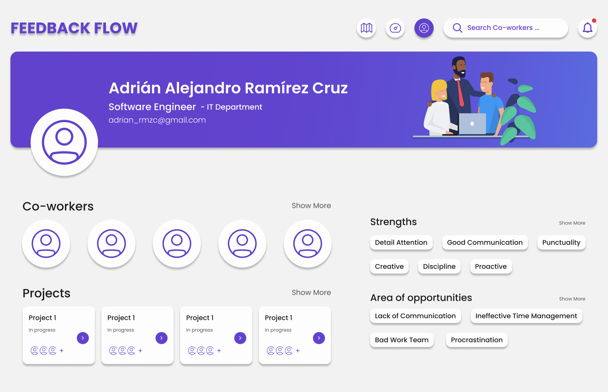

# FeedbackFlow

Una plataforma de retroalimentación y evaluación para empleados dentro de una empresa que usa inteligencia artificial para reducir sesgos, sugerir planes de mejora y ayudar al empleado a resolver dudas diarias.

[📌 Diseño de Figma](https://www.figma.com/file/klnYbVO4bRceWdcZrKkmZq/MockUp?type=design&node-id=0%3A1&mode=design&t=ZbcneFEULlyu53gy-1)

## Problema 
Muchas empresas no cuentan con un sistema para dar retroalimentación entre los empleados, o si lo tienen, está de una manera muy sesgada, esto hace que muchas veces no se reconozca el esfuerzo de ciertos empleados que van muy bien, y no se le de un plan de mejora a aquellos que no van tan bien.

## Solución
Crear una plataforma que pueda brindar feedback y planes de mejora para el usuario, en el que el usuario pueda ver el progreso de este.

## Impacto
Autonocimiento y mejora de las habilidades del empleado, incremento en la productividad del mismo, más justicia dentro de la empresa, disminución de sesgos.

## Usuarios Principales
- Empleados supervisados (SWE)
- Managers
- Chief Officers

## Ideas de funcionalidades

- Dashboard del empleado
    - Propio y de los compañeros
    - Del project manager a su equipo
    - Del CEO a todas las areas que maneja
    - Análisis de métricas con inteligencia artificial generativa
- Análisis de mensajes en Slack
    - Lectura de los mensajes de un canal específico para cuidar que se mantengan las normas de rendimiento y respeto
- Presentación de issues/tasks de Github Projects y código de GitHub
    - Análisis de código y entrega según los guidelines
- Encuestas atómicas de rendimiento y coevaluación
- Asistente virtual de proyectos
- Alerta de rendimiento bajo
    - Detectar con anticipación a los colaboradores con resultados inferiores a los esperados
    - Dar soluciones como asistencia psicológica, workshops o mentoreo a personas en una crisis
- Plan de mejora personalizado generado con IA a partir de reviews
- Corrección de feedback eliminando sesgos e incrementando motivación
